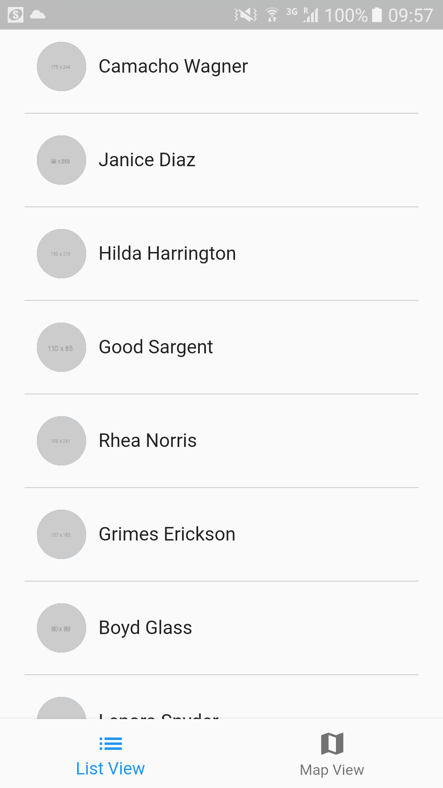
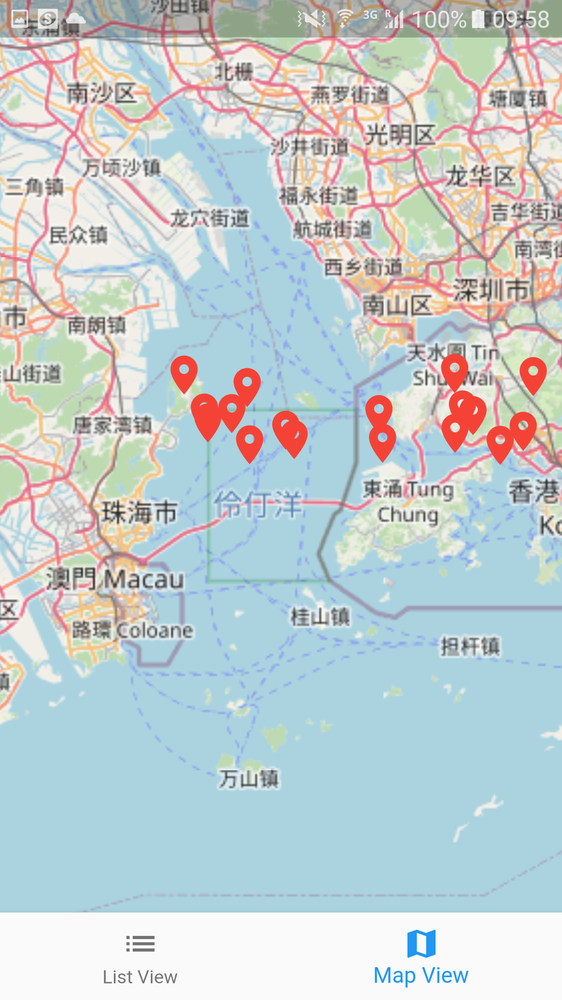

# Overview

This repository is a pre-test project with [Moovup](https://moovup.com/). The detailed requirements for this project could be found at https://github.com/moovup/programming-test/blob/master/mobile.md#question-2.

# Framework

[Flutter](https://flutter.dev/) is adopted for this project, considering its cross-platform property, so one codebase could be compiled into two versions of APPs, i.e. Android and iOS.

In addition, this project is related to map. For fast prototyping, we use a plugin called [flutter_map](https://pub.dev/packages/flutter_map) which applies [OpenStreetMap](https://www.openstreetmap.org/). Though we have other options, such as plugins with Google map and Azure map, `OpenStreetMap` provides public APIs which does not require an account, so we can use it directly without any registering.

# UI

In terms of UI, this project involves three pages.

1. List View

2. Map View
  

3. Personal View

# Build

Flutter is a cross-platform framework, so with the exactly same codebase, we can compile it into a mobile app of 

* either Android version by running:
  
  `flutter build apk`

An .apk file of this project has been complied for your reference. It could be found [here](https://drive.google.com/file/d/1mxG7DV_pRlj-y4HR6jWLk1EoHJZoKhOa/view?usp=sharing).

* or iOS version by running:

  `flutter build ios`
  
  
# Test

1. How to run tests?

<!-- ## Unit test -->

Testing codes are in the `./test` folder.

Run the following command to start testing:

  `flutter test`

or if you want to run a single test, try:

  `flutter test test/{unit_test}.dart`

<!-- ## Integration test

1. Launch the WebDriver

    Refer to [this](https://flutter.dev/docs/cookbook/testing/integration/introduction#6b-web) to download the web driver first, and then launch the web driver.

2. Run the following command for starting the test (assume that the browser is chrome):

        flutter drive --target=test_driver/app.dart --browser-name=chrome --browser-dimension 1280,720 --release -d web-server -->

2. Some tricks adopted for running testing smoothly.
   
* Since any HTTP request in flutter's tests always return a 400, which always make the testings lead to an error. To overcome this, [network_image_mock](https://pub.dev/packages/network_image_mock) is adopted, which will take over the NetworkImage's HTTP request.
